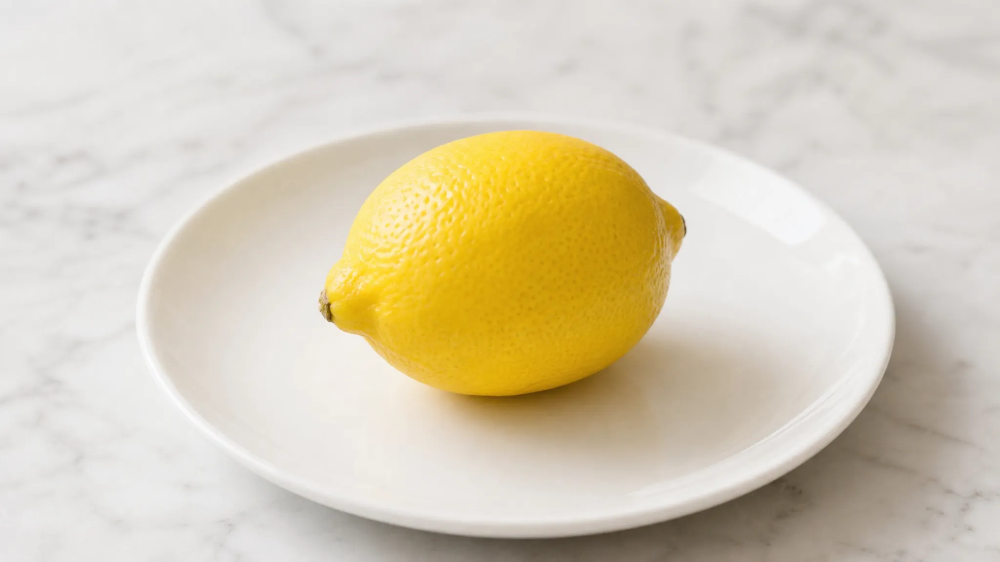

# gpt-image-2 concurrency=20 (2K / 16:9)

Date: 2026-08-05

## Setup

- Model: `gpt-image-2`
- Resolution: `2K` (actual output `2048x1152`)
- Aspect ratio: `16:9`
- Concurrency / requests: **20**
- Prompt (same lemon prompt as the nano-banana-2 ladder):

```text
system: Create a clean, simple illustration. No text overlays, no watermarks.
prompt: A single bright yellow lemon on a white ceramic plate, soft natural light, photorealistic
```

## Results

| metric | value |
| --- | ---: |
| succeeded / requested | 20/20 (100%) |
| level wall (s) | 99.782 |
| throughput (rps) | 0.2004 |

### Latency — wall seconds (successful calls)

| min | p50 | p90 | p95 | p99 | max | mean |
| ---: | ---: | ---: | ---: | ---: | ---: | ---: |
| 57.843 | 94.907 | 95.786 | 99.443 | 99.71 | 99.777 | 84.724 |

### Latency — CLI `elapsed_seconds`

| min | p50 | p90 | p95 | p99 | max | mean |
| ---: | ---: | ---: | ---: | ---: | ---: | ---: |
| 57.297 | 94.349 | 95.319 | 98.892 | 99.204 | 99.282 | 84.203 |

## Sample



Per-call timings: [`summary.json`](./summary.json)
